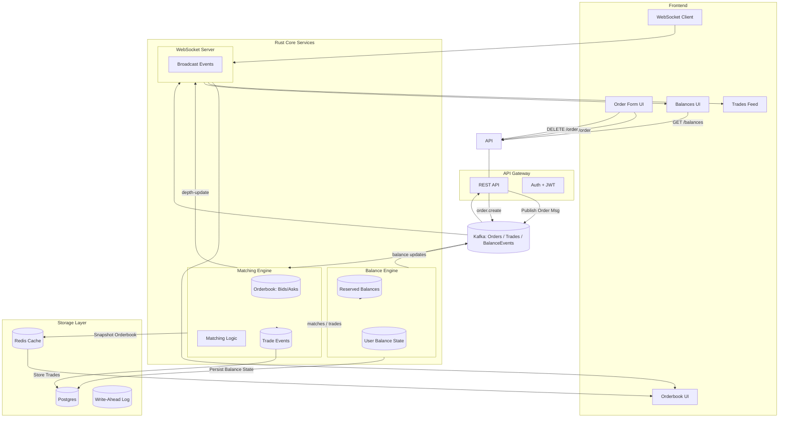

# Exchange (TS)

something like [backpack.exchange](https://backpack.exchange/trade/BTC_USD) or [binance](https://www.binance.com/en-IN/trade/BTC_USDT?type=spot)

so you have a crypto exchange not something like nse or a stock exchange

we are going to build a cex in ts and rust
Centralised Exchange

Read system design from book
Once architecture, design done, start writing apis, their request response, document them
Then slowly start shaping them

Super30 1st project: backpack like exchange in ts and rust; work on system design, db, architecture, what you using, and why; document till exams, then start coding it

Uhh document code with help of jsdocs
Go easy on ui part, don't fuck this up like muskan

[docs on api](https://docs.backpack.exchange/#section/Introduction)
[api-client](https://github.com/backpack-exchange/bpx-api-client)

how binance works:
buyer puts some price, seller puts some price
broker/exchange talks to both
both bid money, then if it is working out, then transaction happen

orderbook: list of order, sell at x, buy at y

so web2 works, but web3 is not liquid cause gas fee

so on blockchain what happens

say eth at 2000$, so when the demand(selling) goes up, price decreases; buying(supply) goes down, price increase

liquidity pools; automated market maker

market maker are people who place order on book

liquidity pool
now say a person has 10 houses, 20cr
1st house: 1cr(sell)
2nd: 1.1cr(sell)
3rd: 1.2cr(sell)

order on other hand:
1st house:70l(buy)
2nd house:65l(buy)

he is a market maker

now he puts all assets(buy+sell) on a pool
so price of single house is?
so we will use constant product market maker
x\*y=constant
x: quantity of 1 asset
y: quantity of 2nd asset

k changes when funds are provided or withdrawn

10\*20=200

took 1 house

so pool changes after that: 9 houses;
so y\*9=200
y=22.22

so to buy 1 house now: 2.22 cr

so again then 8\*x=200 like that
buying increases price also increases

bulding a dex
more liquidity, the better price client gets

amm handles this in single pool

constant product market maker, so x\*y=constant

create a server;
4 operation:

- /add-liquidity
- /buy-asset
- /sell-asset
- /quote

so buying increase price, then people sell since they get profit, so price goes down

# Centralized Exchange (CEX

An exchange like `Binance` in which you don’t own your the underlying asset (ETH/SOL/BTC).

## Decentralized Exchange (DEX)

ex: [drift](https://app.drift.trade/)

A place where people can come and swap assets (ETH for USDC or vice versa) and the assets are `debited from`/ `credited to` their cold storage.

There is no `central` authority that holds the crypto ever

1. CEXs and DEXs are two ways to exchange assets.
2. P2P is another way (Barter system) to do the same.
3. DEX became a popular way to exchange assets when people wanted to keep the custody of their assets with themselves.
4. In the next slide onwards, we’ll understand how to create `tokens` on ETH. This is a pre-requisite before we can understand how we can build an exchange that lets users swap these `tokens`

so ui has like columns:

stock name
bid orders qty offer oders qty

price of stock: price at which last order took place

limit order

- putting a (price, qty) tuble on the orderbook
- usually used by Traders
- Has some trading fee associated with every order that matches

market order

- Buying a qty off the orderbook
- usually used by retail
- usually preceded by a getQuoteReq
- usually higher fee than limit order

liquidity/market depth

- How many orders (price/ qty) does the book have
- Can it handle big ordors w/o crashing the price
- More liquidity= Better exchange
- Market maker provide liquidity.

## Maker v/s Taker

- person whose order exist on book: maker
- person who gets their order filled: taker
- tkaer fee>maker fee b/c they take away liquidity from book.

## where does latency matter

→ Exchange

- Order blacement time
- Time to fetch the orderbook
- Realtime updates on the orderbook

→ Trader

- Order ace time
- Ordor cancel time
- Their Order priority.

# latency in exchange

- fast languages
- faster serialisation/deserialisation of data
- in memory databases

## how latency is made better

- being closer to server
- multiple connections to server
- faster serialisation/deserialisation
- faster oracles/prediction models

# exchange orderbook

user can : - place Limit orders - If an order can be executed(partially a completely) it is filled - Users can query the depth chart - User can get back thin balance

# Routes

- `/order`, POST

```json
    {
        userId:str,
        side:buy/sell,
        price:number,
        qty:number
        ticker:google/usdc
    }
```

- `/balance`,
  request: GET

```json
    {
        userId
    }
```

response:

```json
{
    usdBalance,
    googleBalance
}
```

- `/depth`
  returns bids and asks

---

stack: ts, ws, redis, kafka, postgres
